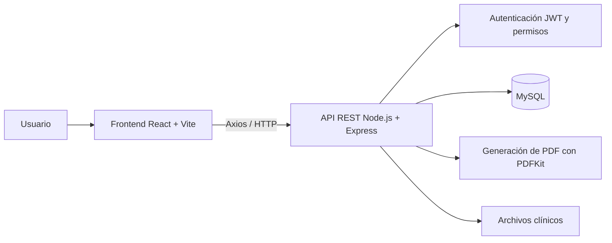

# DENTOKLIN 🦷

**Showcase técnico de un sistema web full stack para gestión clínica y administrativa odontológica.**

DENTOKLIN nace con el objetivo de centralizar procesos que normalmente se encuentran dispersos entre fichas físicas, documentos, agenda y controles administrativos. El sistema integra información clínica, operativa y financiera dentro de una sola aplicación web.

> El código fuente principal se mantiene en un repositorio privado. Este repositorio público presenta la arquitectura, tecnologías, funcionalidades y decisiones técnicas del proyecto sin exponer información sensible.

---

## 📌 Sobre el proyecto

DENTOKLIN permite gestionar el flujo de atención de una clínica odontológica desde el registro del paciente hasta el seguimiento clínico y administrativo.

Entre los módulos implementados se encuentran:

- Autenticación, usuarios, roles y permisos
- Gestión de pacientes
- Historia clínica y evoluciones
- Odontograma clínico
- Planes de tratamiento
- Catálogo de procedimientos
- Presupuestos y descuentos
- Pagos y estado de cuenta
- Caja
- Agenda de citas
- Archivos clínicos
- Auditoría
- Reportes
- Configuración

El sistema fue diseñado manteniendo trazabilidad, reglas de negocio, control de acceso e integridad de datos.

---

## 🧰 Stack tecnológico

### Frontend
- React 19
- JavaScript
- Vite
- React Router
- Axios
- HTML5
- CSS3

### Backend
- Node.js
- Express
- API REST
- JWT
- bcrypt
- Multer
- PDFKit

### Base de datos
- MySQL
- MySQL2
- SQL
- Migraciones y esquema versionado

### Calidad y herramientas
- Git
- GitHub
- Vitest
- Testing Library
- Node Test Runner
- Oxlint
- pnpm

---

## 🏗️ Arquitectura general

La aplicación separa frontend, backend, base de datos y documentación. El backend actúa como fuente de verdad para operaciones clínicas, financieras y generación de documentos.

[Ver arquitectura técnica](docs/architecture.md)

---

## 🦷 Odontograma clínico

El odontograma es uno de los módulos principales del sistema.

Incluye:

- Dentición permanente y temporal con numeración FDI
- Estado general por pieza
- Registro por superficies
- Múltiples hallazgos clínicos
- Validaciones de pieza y superficie
- Historial y versiones
- Snapshots
- Comparación entre estado histórico y actual
- Registro por arcadas
- Generación de PDF clínico

El diseño busca conservar la trazabilidad de los cambios y evitar que el odontograma se convierta en una fuente no controlada de tratamientos o presupuestos.

---

## 🔐 Seguridad y control de acceso

DENTOKLIN implementa:

- Autenticación mediante JWT
- Contraseñas protegidas con bcrypt
- Middleware de autenticación
- Permisos evaluados por endpoint y acción
- Restricciones adicionales para operaciones clínicas
- Variables sensibles mediante archivos de entorno
- Auditoría de operaciones relevantes

Los secretos, credenciales y archivos de entorno reales no forman parte de este repositorio público.

---

## 📄 Generación de documentos

El backend genera documentos PDF para diferentes procesos del sistema, evitando depender del frontend como fuente de verdad.

Entre ellos:

- Historia clínica
- Odontograma
- Planes de tratamiento
- Presupuestos

---

## ✅ Calidad y pruebas

Durante el cierre funcional V1 se registró:

- **Backend:** 161 pruebas totales
  - 152 aprobadas
  - 9 omitidas de forma condicionada para integración con MySQL
  - 0 fallidas
- **Frontend:** 172 pruebas aprobadas
  - 0 fallidas
- **Build de frontend:** correcto
- **git diff --check:** correcto

Estas cifras corresponden al checkpoint funcional documentado del **23/09/2026**.

[Ver estrategia de calidad y pruebas](docs/quality-and-testing.md)

---

## 👨‍💻 Trabajo realizado

En este proyecto he trabajado en diferentes áreas del desarrollo full stack, entre ellas:

- Construcción e integración de interfaces con React
- Desarrollo y consumo de APIs REST
- Implementación de lógica backend con Node.js y Express
- Modelado y consultas en MySQL
- Autenticación y autorización por permisos
- Reglas de negocio clínicas y financieras
- Historial, auditoría y trazabilidad
- Generación de documentos PDF
- Pruebas automatizadas
- Control de versiones con Git y GitHub
- Documentación técnica y funcional

El proyecto continúa evolucionando y se utiliza también como experiencia práctica para fortalecer mis conocimientos de ingeniería de software.

---

## 🎯 Objetivo del showcase

Este repositorio tiene como finalidad presentar DENTOKLIN a reclutadores y equipos técnicos sin publicar el repositorio privado de producción/desarrollo.

Aquí se documentan las decisiones técnicas y las capacidades principales del sistema de forma segura.

---

## 👤 Autor

**Anderson Garay**  
Estudiante de Ingeniería de Software con Inteligencia Artificial en SENATI  
Desarrollador Web | Frontend / Full Stack Trainee

- [GitHub](https://github.com/garayander06-hub)
- [LinkedIn](https://www.linkedin.com/in/ander-garay-49a67b429/)
