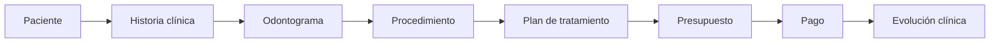

# Arquitectura técnica de DENTOKLIN

## Visión general

DENTOKLIN utiliza una arquitectura web separada en frontend, backend y base de datos.

```mermaid
flowchart TD
    USER[Usuario] --> FRONT[React + Vite]
    FRONT --> ROUTER[React Router]
    FRONT --> HTTP[Axios]
    HTTP --> API[Express REST API]

    API --> AUTH[JWT / permisos]
    API --> CTRL[Controladores]
    CTRL --> SERVICES[Servicios]
    SERVICES --> DB[(MySQL)]
    SERVICES --> PDF[PDFKit]
    SERVICES --> FILES[Archivos clínicos]

    API --> AUDIT[Auditoría]
    AUDIT --> DB
```

## Frontend

El frontend utiliza React con Vite y está organizado como una aplicación web independiente.

Responsabilidades principales:

- Presentar la interfaz de usuario.
- Gestionar navegación entre módulos.
- Consumir la API mediante Axios.
- Aplicar restricciones de interfaz según permisos.
- Mostrar estados de carga, error y validación.
- Ejecutar pruebas de componentes y flujos con Vitest y Testing Library.

El frontend no debe reemplazar al backend como fuente de verdad para cálculos financieros, documentos clínicos o reglas críticas.

## Backend

El backend utiliza Node.js y Express.

La estructura incluye, entre otros:

- `routes/`
- `controllers/`
- `services/`
- `middleware/`
- `config/`
- `tests/`
- `utils/`

Responsabilidades principales:

- Exponer endpoints REST.
- Autenticar usuarios mediante JWT.
- Autorizar operaciones por permisos.
- Aplicar reglas clínicas y financieras.
- Acceder a MySQL mediante MySQL2.
- Gestionar auditoría y trazabilidad.
- Generar documentos PDF con PDFKit.
- Gestionar archivos clínicos.

## Base de datos

La persistencia principal utiliza MySQL.

El proyecto mantiene:

- Esquema SQL versionado.
- Migraciones.
- Relaciones y claves foráneas.
- Datos de inicialización controlados.
- Reglas orientadas a preservar integridad clínica y financiera.

## Seguridad

Las credenciales se obtienen mediante variables de entorno.

El repositorio privado ignora archivos `.env` reales y conserva únicamente un ejemplo sin secretos.

La autorización se aplica en backend por endpoint y acción. Algunas operaciones clínicas requieren además que el usuario esté relacionado con un profesional activo.

## Flujo clínico simplificado

El odontograma registra el estado clínico y los hallazgos; no funciona como presupuesto ni sustituye el plan de tratamiento.

## Separación de responsabilidades

Una decisión importante del proyecto es mantener responsabilidades claras:

- **Frontend:** interacción y presentación.
- **Backend:** reglas de negocio y contratos.
- **MySQL:** persistencia e integridad.
- **PDFKit/backend:** documentos oficiales.
- **Auditoría:** trazabilidad de acciones relevantes.

Esta separación facilita pruebas, mantenimiento y evolución del sistema.
